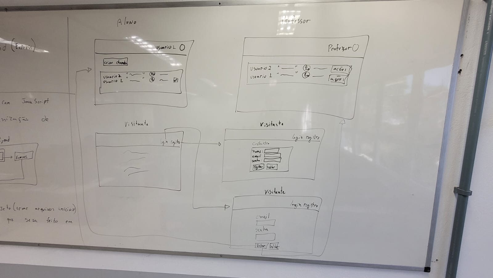

# AtendeAí — Fila de Ajuda em Sala

> **Objetivo**: organizar a fila de atendimento em aulas práticas para reduzir a espera, dar visibilidade da ordem e tornar o processo mais justo para todos.

## 📌 Sumário
1. [Problema](#1-problema)  
2. [Atores e Decisores](#2-atores-e-decisores-quem-usa--quem-decide)  
3. [Casos de Uso](#3-casos-de-uso-de-forma-simples)  
4. [Limites, Suposições e Plano B](#4-limites-e-suposições)  
5. [Hipóteses + Validação](#5-hipóteses--validação)  
6. [Fluxo Principal e Primeira Fatia](#6-fluxo-principal-e-primeira-fatia)  
7. [Esboços (Wireframes)](#7-esboços-de-algumas-telas-wireframes)  
8. [Tecnologias](#8-tecnologias)  
9. [Plano de Dados (Dia 0)](#9-plano-de-dados-dia-0--somente-itens-1–3)  
10. [Como rodar localmente (passo a passo)](#-como-rodar-localmente-passo-a-passo)  
11. [Referência de API (iniciante)](#-referência-de-api-iniciante)  
12. [Erros comuns](#-erros-comuns)  
13. [Glossário rápido](#-glossário-rápido)

---

## 1) Problema
- Em aulas práticas, **alunos esperam muito** para serem atendidos.  
- Há **filas confusas** e frustração. O professor **não vê ordem** nem **tempo de espera**.  
- **Objetivo inicial**: organizar a fila para reduzir a espera e garantir **justiça**.

## 2) Atores e Decisores (quem usa / quem decide)
- **Atores**: Visitantes (ainda não logados), **Alunos** e **Professores**  
- **Decisores/Apoiadores**: Professores; Coordenação do curso

## 3) Casos de uso (de forma simples)
- **Visitante**: Criar usuário e **logar** no sistema  
- **Aluno/Professor**: **Deslogar**; **Manter dados cadastrais**  
- **Professor**: **Manter** (listar, mostrar, inserir, editar, remover) **todos** os chamados  
- **Aluno**: **Manter seus próprios** chamados (listar, mostrar, inserir, editar, remover)

## 4) Limites e suposições
- **Limites**: entrega final até o fim da disciplina (ex.: **2025-11-30**); rodar no **navegador**; **sem serviços pagos**.  
- **Suposições**: internet no laboratório; navegador atualizado; acesso ao GitHub; **10 min** para teste rápido.  
- **Plano B**: sem internet → rodar local e salvar em **LocalStorage**; sem tempo do professor → testar com **3 colegas**.

## 5) Hipóteses + validação
- **Valor**: Se o aluno **vê sua posição na fila**, sente mais controle e conclui melhor a atividade.  
  - **Validação**: teste com **5 alunos**; sucesso se **≥ 4** abrirem/fecharem chamado **sem ajuda**.

- **Viabilidade**: Com app no navegador (**HTML/CSS/JS + armazenamento local**), criar e listar chamados **responde em até 1s** na maioria das vezes (ex.: 9/10).  
  - **Validação**: medir no protótipo com **30 ações**; meta: **≥ 27** em **1s** ou menos.

## 6) Fluxo principal e primeira fatia
**Fluxo principal**  
0) Aluno cria conta →  
1) Aluno faz login →  
2) Clica em **Criar chamado** e descreve a dúvida →  
3) Sistema **salva** e coloca **na fila** →  
4) Lista mostra **ordem** e **tempo desde a criação** →  
5) Professor faz login →  
6) Professor **encerra** o chamado.

**Primeira fatia vertical (MVP)**  
- Inclui **login simples**, **criar chamado**, **listar em ordem**.  
- **Critérios de aceite**:  
  - criar → aparece na lista **com horário**  
  - encerrar → **some** da lista ou aparece como **fechado**.

## 7) Esboços de algumas telas (wireframes)
Coloque aqui **links/imagens** dos rascunhos (papel, Figma, Excalidraw…).  
Exemplos de telas: **Login**, **Lista de chamados**, **Novo chamado**, **Painel do professor**.  
```

```

## 8) Tecnologias

### 8.1 Navegador
- **Navegador**: HTML/CSS/JS/Bootstrap  
- **Armazenamento local**: **LocalStorage (apenas protótipo/MVP sem servidor)**  
- **Hospedagem (front estático)**: **GitHub Pages**

### 8.2 Front-end (app cliente)
- **Front-end**: React (evolução natural do protótipo)  
- **Hospedagem**: GitHub Pages (ou outra, conforme evolução)

### 8.3 Back-end (API/servidor)
- **Back-end (API)**: JavaScript com **Express**  
- **Banco de dados**: **PostgreSQL** (ou MySQL; neste README focamos em **Postgres**)  
- **Deploy do back-end**: a definir (Heroku/Render/Fly.io/VPS)

> 💡 Para **Dia 0**, você pode testar **sem servidor**, apenas com o **navegador** (LocalStorage).  
> Para **evolução**, use a **API Express + Postgres** já modelada abaixo.

---

## 9) Plano de Dados (Dia 0) — somente itens 1–3

### 9.1 Entidades
- **Usuario** — pessoa que usa o sistema (aluno/professor), autentica-se e pode abrir/gerenciar chamados.  
- **Chamado** — solicitação de ajuda criada por um usuário, com descrição do problema, estado (aberto/fechado) e metadados; pertence a um **Usuario** via `Usuarios_id`.

### 9.2 Campos por entidade

#### Usuarios
| Campo           | Tipo                          | Obrigatório | Exemplo            |
|-----------------|-------------------------------|-------------|--------------------|
| id              | número                        | sim         | 1                  |
| nome            | texto                         | sim         | "Ana Souza"        |
| email           | texto                         | sim (único) | "ana@exemplo.com"  |
| senha_hash      | texto                         | sim         | "$2a$10$..."       |
| papel           | número (0=aluno, 1=professor) | sim         | 0                  |
| dataCriacao     | data/hora                     | sim         | 2025-08-20 14:30   |
| dataAtualizacao | data/hora                     | sim         | 2025-08-20 15:10   |

#### Chamados
| Campo           | Tipo        | Obrigatório | Exemplo            |
|-----------------|-------------|-------------|--------------------|
| id              | número      | sim         | 2                  |
| Usuarios_id     | número (fk) | sim         | 1                  |
| texto           | texto       | sim         | "Erro ao compilar" |
| estado          | char        | sim         | 'a' \| 'f'         |
| urlImagem       | texto       | não         | '/img/icone.png'   |
| dataCriacao     | data/hora   | sim         | 2025-08-20 14:35   |
| dataAtualizacao | data/hora   | sim         | 2025-08-20 14:50   |

### 9.3 Relações entre entidades
- Um **Usuario** tem muitos **Chamados**. (1→N)  
- Um **Chamado** pertence a um **Usuario**. (N→1)  
  - *(FK: `Chamados.Usuarios_id` → `Usuarios.id`)*

### 9.4 Modelagem do banco de dados no POSTGRES

```sql
-- Tabelas em Postgres (tipos simples e checks claros).
-- Observação: mantemos INTEGER em ambos os lados da FK para compatibilizar.

CREATE TABLE Usuarios (
  id                SERIAL       PRIMARY KEY,
  nome              VARCHAR(255) NOT NULL,
  email             VARCHAR(255) NOT NULL UNIQUE,
  senha_hash        VARCHAR(255) NOT NULL,
  papel             SMALLINT     NOT NULL CHECK (papel IN (0,1)),  -- 0=aluno, 1=professor
  data_criacao      TIMESTAMP    NOT NULL DEFAULT now(),
  data_atualizacao  TIMESTAMP    NOT NULL DEFAULT now()
);

CREATE TABLE Chamados (
  id                SERIAL       PRIMARY KEY,
  Usuarios_id       INTEGER      NOT NULL REFERENCES Usuarios(id),
  texto             VARCHAR(255) NOT NULL,
  estado            CHAR(1)      NOT NULL CHECK (estado IN ('a','f')), -- a=aberto, f=fechado
  urlImagem         VARCHAR(255),
  data_criacao      TIMESTAMP    NOT NULL DEFAULT now(),
  data_atualizacao  TIMESTAMP    NOT NULL DEFAULT now()
);

-- Dados de exemplo (NÃO use senha '123' em produção; aqui é só rascunho)
INSERT INTO Usuarios (nome, email, senha_hash, papel) VALUES
('Usuário', 'user@user.com.br', '123', 0),
('Admin',   'admin@admin.com.br', '123', 1);

INSERT INTO Chamados (Usuarios_id, texto, estado) VALUES
(1, 'Preciso de ajuda com JS', 'a');
```

> ✅ **Dica para iniciantes**: `SERIAL` cria um número automático (1, 2, 3…).  
> ✅ `CHECK (estado IN ('a','f'))` impede salvar valores diferentes de **a** (aberto) e **f** (fechado).

---

## 🔧 Como rodar localmente (passo a passo)

### 1) Pré-requisitos
- **Node.js** instalado (versão LTS recomendada)  
- **PostgreSQL** rodando localmente

### 2) Criar arquivo `.env` na raiz do projeto
```env
# Porta da API
PORT=3000

# Postgres
DB_HOST=localhost
DB_PORT=5432
DB_USER=postgres
DB_PASSWORD=postgres
DB_DATABASE=atendeai_db
```

### 3) Instalar dependências e iniciar
```bash
npm install
npm run dev   # ou: node server.js / npm start (conforme seu package.json)
```

### 4) Criar as tabelas
- Abra o **psql** (ou pgAdmin) e execute o script SQL da seção **9.4**.  
- Ajuste usuário/senha/porta conforme o seu Postgres.

### 5) Testar rapidamente com `curl`
```bash
# Lista endpoints raiz
curl http://localhost:3000/

# Lista produtos (se você tiver a API de produtos ligada à mesma base/stack)
curl http://localhost:3000/api/produtos

# Criar um produto
curl -X POST http://localhost:3000/api/produtos   -H "Content-Type: application/json"   -d '{"nome":"Caneta","preco":5.5}'

# Mostrar por id
curl http://localhost:3000/api/produtos/1

# Atualizar (PUT)
curl -X PUT http://localhost:3000/api/produtos/1   -H "Content-Type: application/json"   -d '{"nome":"Caneta Azul","preco":6.0}'

# Atualizar parcialmente (PATCH)
curl -X PATCH http://localhost:3000/api/produtos/1   -H "Content-Type: application/json"   -d '{"preco":6.2}'

# Deletar
curl -X DELETE http://localhost:3000/api/produtos/1
```

---

## 📚 Referência de API (iniciante)

### Convenções
- **Corpo JSON** sempre com `Content-Type: application/json`.  
- **Status comuns**:  
  - `200 OK` (deu certo), `201 Created` (criado), `204 No Content` (deletado)  
  - `400 Bad Request` (dados inválidos), `404 Not Found` (não achou), `500 Internal Server Error` (erro inesperado)

### Erro-padrão (exemplo)
```json
{ "erro": "mensagem explicando o problema" }
```

> Ex.: `{"erro": "id inválido"}` quando o id não é inteiro positivo.

---

## 🐞 Erros comuns
- **`req.body` veio `undefined`** → faltou `app.use(express.json())` ou o cliente não enviou `Content-Type: application/json`.  
- **Conexão com banco falhou** → confira `.env` (host, porta, usuário, senha, banco).  
- **“relation does not exist”** → as tabelas não foram criadas; execute o SQL da seção 9.4.  
- **Senha em texto puro** → no exemplo é didático; em produção, use **hash** (ex.: bcrypt).

---

## 🧭 Glossário rápido
- **Fila**: lista ordenada de chamados (normalmente por hora de criação).  
- **Chamado**: pedido de ajuda feito pelo aluno.  
- **Estado**: `'a'` (aberto) ou `'f'` (fechado).  
- **Dia 0**: primeiro recorte funcional mínimo (o mínimo para aprender/testar).
